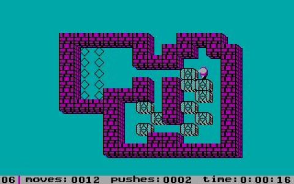

# Sokoban

**Sokoban features a warehouse that is depicted as a grid of squares, each one representing either a floor section or a wall section. Some floor squares contain boxes and some are marked as storage locations. The player, often represented as a worker character, can move one square at a time horizontally or vertically onto empty floor squares, but cannot pass through walls or boxes. The number of boxes equals the number of storage locations. The puzzle is solved when all boxes are located on storage locations.**

<figure style="margin-bottom: 1rem; text-align: center">
  
  <figcaption>"Modern" version</figcaption>
</figure>

<figure style="margin-bottom: 1rem; text-align: center">
  
  <figcaption>Orignal version</figcaption>
</figure>

### Inspiration

Your assignment is to create you version of this classical game. For inspiration, check out [this youtube video.](https://www.youtube.com/watch?v=xvu6r5_4_T4) There exists more videos on yotube. Just google for ut.

You can also try the orignal game [here.](https://www.retrogames.cz/play_409-DOS.php) There are countless other versions of the games as well.

### Group Assignment - Scrum

This is a group assignment which means you need to work together in your team. The requirement here is that you work according to scrum. Now we have talked about scrum earlier in this course. Now I don't expect you to do it flawlessly but you will try, and see this as good practise for the future. When working with scrum you will need to make use of the five scrum events that you have learned.

- Sprint

  1. Sprint Planning
  2. Daily Scrum
  3. Sprint Review
  4. Spring Retrospective

The sprint will be two weeks long and the entire assignment period is four weeks. That means two sprints. So everything will come in two, exepct the dailies that will occur every weekday, at an agreed time together with the group.

I have included the PDF from earlier lessons that you can use as documentation from scrum.

### Requirements for Sokoban

The game must be create with Vite, React and TypeScript.

The basic requirements are the ones you can observe in the youtube video and the game at the top. But a small summary _( might be incomplete )_:

[Back to inspiration](#inspiration)

- The character should be movable.
- To move a box, the player walks up to it and pushes it to the square beyond.
- Boxes cannot be pushed to squares with walls or other boxes, and they cannot be pulled.
- When a box is on a storage location, the boxes should indicate that.
- The puzzel is solved when all boxes occupies all the storage locations.
- At least two levels.
- Keep track of moves, pushes and the time.

#### Extra

- More levels, if you complete one, go to the next.
- Powerups! Create at least three of them. Examples might be:
  - **Bomb**: A box explodes the nearest box _( you might have accidentally moved it in to corner )_, thus removing one storage location.
  - **Super strenght**: You can move two boxes in front of you.
  - **Drill Machine**: You can drill thorugh a wall, creating more ways to move boxes to the storage locations.
  - ..or any other power up with similar complexity.

#### Grapich and inputs

You controll the character with the arrow keys or mouse clicking. The graphich should resemble one of the versions from inspiration, but your creactivity here is limitless. Focus on the logic first, and the then the looks.
